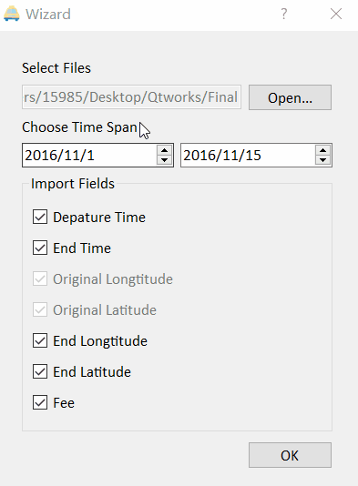
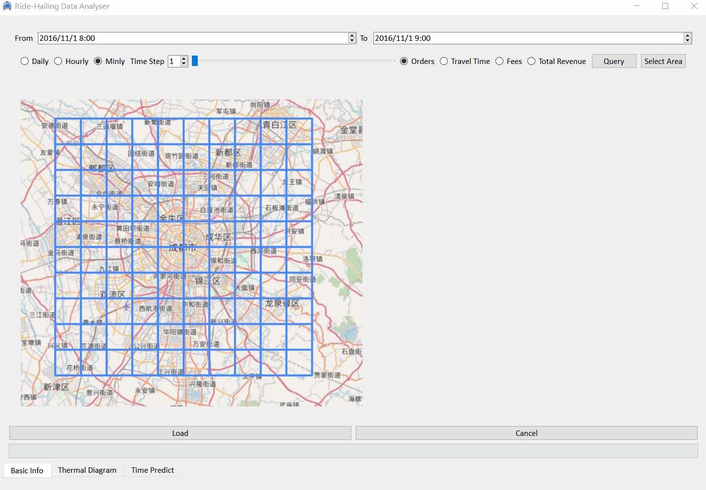
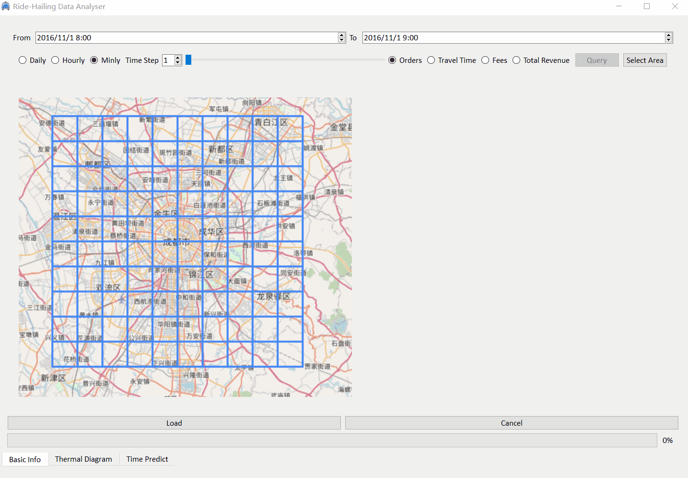
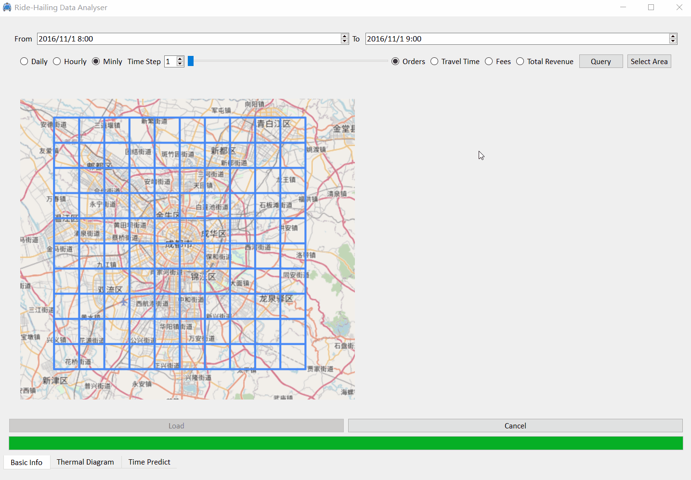
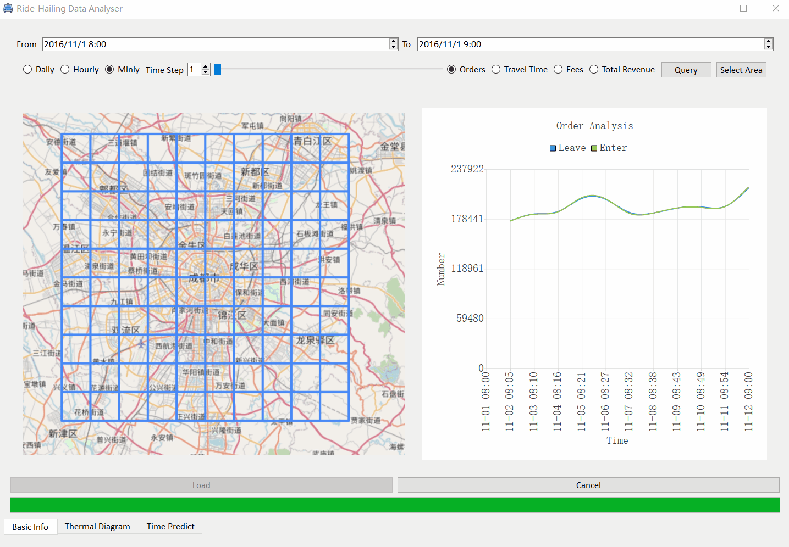
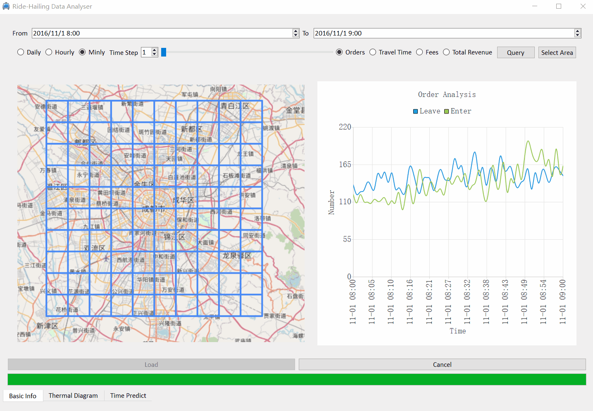
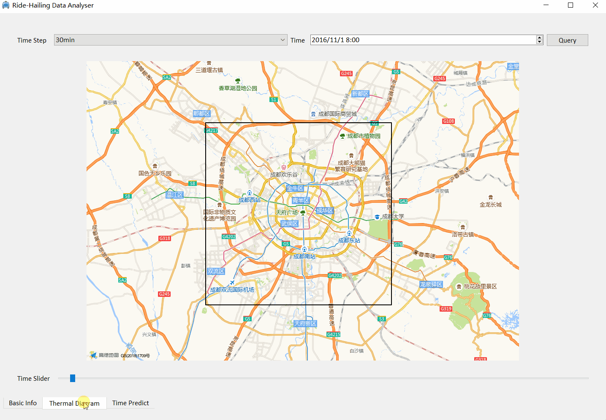
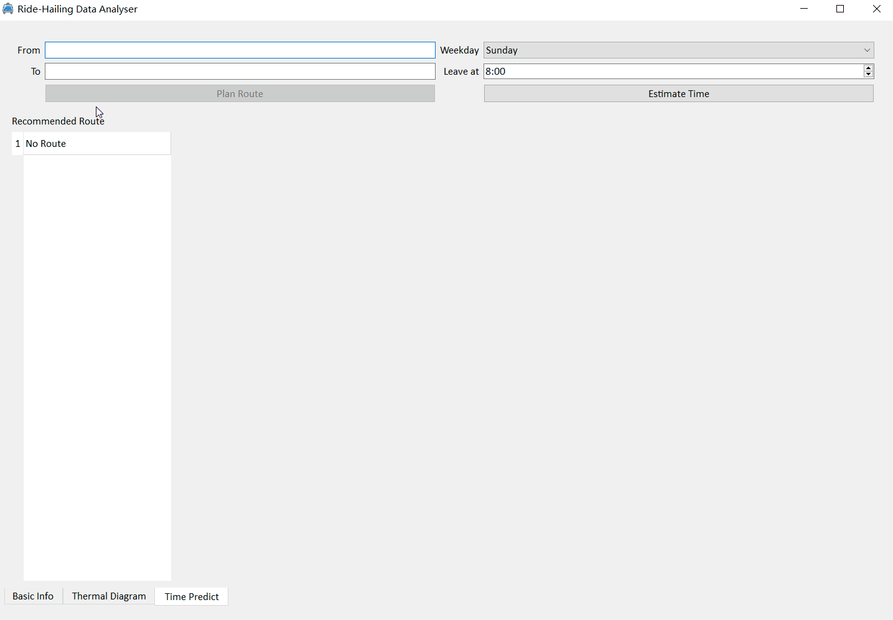
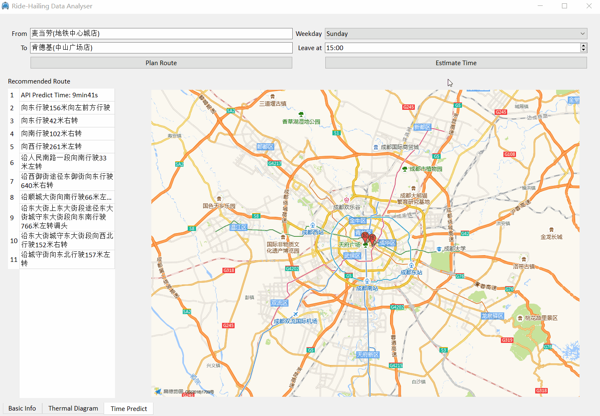

# Ride-Hailing-DataAnalyzer
🚖A Flexible and Multifunctional App for Analyzing Online Ride-hailing data

## Build Requirements

```shell
    Qt 5.15.1 MinGW 32 
    Make sure you have installed QtCharts and QtNetwork
```
Open the .pro file in Qt and build the project.

## Wizard

Set the correct path of the dataset.  
Pay attention that you should choose the parent directory of the folder "dataset".  
Choose fields you're interested in.  
Click OK and you'll enter the Mainwindow.  


## Load Data from .csv files

In MainWindow, click the "Load" button and wait.  
After a while(approximately 20 secs), the progress bar will increase to 100%, which is the symbol of the fin of the load task.  
Click "Cancel" button to quit to the Wizard if you have chosen the wrong fields.  


## Select Grids

A screen-shot style grids selection method has been implemented.  
Click the "Select Area" button, your desktop will be in dark mode and simple press and move your mouse to choose grids(highlighted) you're interested in.    
Press "Enter" key to quit after selection, "Esc" key to force quit.  


## Chart Analysis

Click "Query" button to access for your chart.(It will be shown on the right)   
Edit two lineEdits above to tune start and end time.  
Choose your timeStep either click the spinbox or drag the slider.    


Switch radio buttons to change your chart type.


We also realized rubberband to analyze the chart in details.


## Thermal Diagram

Based on the area you have selected, the app will call the [Gaode's API](https://lbs.amap.com/api/webservice/) to return a pixture on "Thermal Diagram" widget.  
Choose start time and time step using DateTimeEdit or the comboBox above.  
Click "Query" button or drag the slider below to ask for heat map on different time.(The slider could be moved by "→" or "←" on the keyBoard)  


## Navigation

Navigation has been done using [Gaode's API](https://lbs.amap.com/api/webservice/).  
Input location names in lineEdits and the Completer will appear, allowing you to choose exactly one of them.  
Pay attention that:
```
Must enter one key first to activate the Completer. For example, first"麦" then "当" and the Completer will appear.
Must choose one place in Completer for right service.
Press "Enter" key or click other widgets to enable "Plan Route" button after setting start and end locations.
```  
Click "Plan Route" button for navigation information.  


## Time Prediction

Time prediction is implemented by two methods.  
1. Find spatial and time related orders in the dataset and compute their average travel time as the output.  
2. Train neural network on the dataset and use the model for prediction.
   NN information:
    1.Input(29-dimension vector):
    ```
        startTime one-hot(5-dimension vector)
        weekday one-hot(2-dimension one-hot)
        standardization origin longtitude and latitude
        origin spatial one-hot(9-dimension one-hot)
        standardization destination longtitude and latitude
        destination spatial one-hot(9-dimension one-hot)
    ```
    2.Network: 6 Linear layer with Relu activate function
    3.Output: standardization predict time
    4.Accuracy: The average deviation is 4min, and the deviation is less than 5min with the probability 77.5%.
        
Simply click the "Estimate Time" button after input the origin and destination name, the result will show in the tableWidget on the left.



